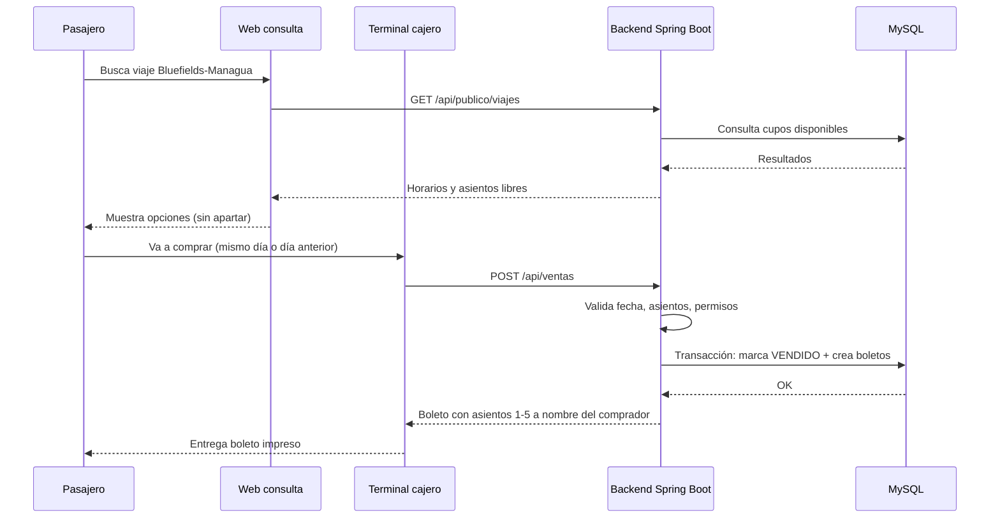

# Arquitectura y stack tecnológico

Documento orientado a presentación del proyecto **Sistema de Gestión de Transporte Interurbano Bluefields – Managua**.

---

## Visión general

Plataforma **multiempresa** que digitaliza la venta de boletos en terminal y la consulta pública de cupos, reemplazando cuadernos manuales.

**Regla central:** no hay reservas. El pasajero consulta en línea, pero compra en la terminal el día anterior o el mismo día del viaje.

---

## Stack propuesto

| Capa | Tecnología | Función |
|------|------------|---------|
| **Frontend** | React + Material UI | Consulta pública, panel de cajero y administración |
| **Backend** | Spring Boot 3 (Java 17) | API REST, reglas de negocio, seguridad |
| **Base de datos** | MySQL 8 (relacional) | Persistencia transaccional |
| **Migraciones** | Liquibase | Versionado del esquema de BD (YAML + SQL) |
| **Seguridad** | Keycloak + OAuth2/JWT | Autenticación, roles (CAJERO, ADMIN_EMPRESA, ADMIN_GENERAL) |
| **Documentación API** | Swagger / OpenAPI | Contrato entre frontend y backend |
| **Infraestructura** | Docker | MySQL y despliegue reproducible |

---

## Por qué Spring Boot

1. **Reglas de negocio complejas** — ventas, asientos, permisos, equipaje extra.
2. **API REST** — el frontend (React) consume endpoints sin acoplarse a la lógica interna.
3. **Transacciones** — una venta de 5 asientos debe ser atómica: o se venden todos o ninguno.
4. **Escalabilidad** — soporta más empresas, reportes, pagos en línea y encomiendas en fases futuras.
5. **Ecosistema maduro** — JPA, validaciones, integración con MySQL y herramientas de seguridad.

---

## Por qué MySQL relacional

El dominio tiene relaciones claras y transaccionales:

- Una **empresa** tiene varios **buses**.
- Un **bus** tiene muchos **asientos** (ventana / pasillo).
- Un **viaje** copia el mapa de asientos del bus con su propio estado.
- Una **venta** puede incluir varios **boletos** (compra familiar a un solo nombre).

Una base relacional garantiza integridad referencial (FK, UNIQUE, CHECK) y consultas eficientes de cupos disponibles.

---

## Estructura del proyecto

```
SISTEMA-DE-GESTION-TRANSPORTE/
│
├── backend/                    ← Lógica y datos
│   ├── controller/             ← Entrada HTTP (REST)
│   ├── service/                ← Reglas de negocio
│   ├── repository/             ← Acceso a MySQL
│   ├── domain/entity/          ← Tablas mapeadas (JPA)
│   ├── dto/                    ← Objetos de entrada/salida API
│   ├── exception/              ← Errores de negocio y HTTP
│   └── resources/db/changelog/ ← Liquibase
│
├── frontend/                   ← Interfaz de usuario (fase posterior)
│   ├── consulta pública        ← Solo lectura: horarios y cupos
│   └── panel operador/admin    ← Venta en terminal y gestión
│
├── docs/                       ← Documentación del proyecto
└── docker-compose.yml          ← MySQL local
```

### Responsabilidad por capa

| Capa | Responsabilidad | No debe hacer |
|------|-----------------|---------------|
| **Controller** | Recibir JSON, validar formato, devolver respuesta HTTP | Decidir si un asiento se puede vender |
| **Service** | Aplicar reglas de negocio y coordinar transacciones | Conocer detalles de HTTP |
| **Repository** | Consultar y guardar en MySQL | Validar reglas de venta |
| **Frontend** | Mostrar datos y capturar formularios | Ser la única defensa de las reglas |

---

## Actores y permisos

| Actor | Acceso |
|-------|--------|
| **Pasajero (público)** | Consultar horarios, empresas y asientos libres |
| **Operador / Cajero** | Vender boletos, asignar asientos, equipaje extra |
| **Admin empresa** | Buses, viajes, operadores, reportes propios |
| **Admin general** | Registrar empresas, supervisión global (selector de tenant) |
| **Permiso RESERVA_EXCEPCIONAL** | Único que puede apartar asiento sin venta inmediata (fase futura) |

### Aislamiento multi-tenant

- Cada **empresa = tenant** (Wendelyn, Martínez, …).
- **Consulta pública:** agrega viajes de todos los operadores (como tablero de terminal).
- **Back-office (cajero/admin empresa):** solo datos del tenant del usuario autenticado.
- **Admin general:** puede operar cualquier tenant; el frontend muestra selector de cooperativa.
- Validación en backend vía `OperadorContext.resolverEmpresaId()` — el frontend no es la única defensa.

---

## Flujo principal (sin reserva)



---

## Fases de implementación

| Fase | Alcance |
|------|---------|
| **1 – MVP** | Empresas, buses, viajes, venta en terminal, consulta pública, multiempresa |
| **2** | Notificaciones, historial, reportes avanzados |
| **3** | Pago en línea, boleto digital, QR (sin cambiar regla de no reservar por defecto) |
| **4** | Encomiendas y seguimiento de paquetes |

---

## Documentos relacionados

- [Guía de demostración (entrega docente)](DEMO.md)
- [Modelo de datos](MODELO-DATOS.md) — diagrama ER y tablas
- [Validaciones del sistema](VALIDACIONES.md) — reglas por módulo
- [Esquema SQL](database-schema.sql) — script MySQL completo
- PDF de requisitos en la raíz del proyecto
