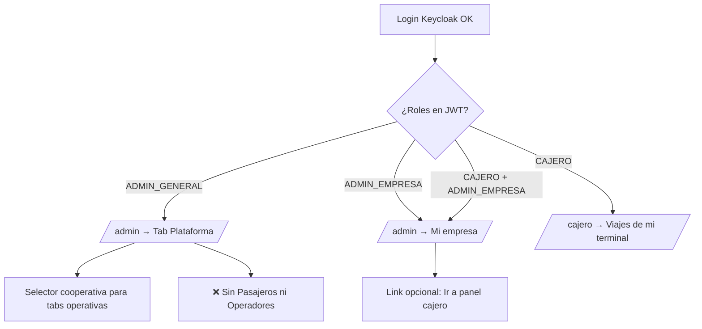

# Diseño por roles — Web y Móvil

Documento maestro para alinear **reglas de negocio (RN)**, **permisos backend** y **experiencia de usuario** en React y Flutter.

---

## 1. Actores del sistema

| Actor | ¿Login? | Rol Keycloak | Empresa en BD | Terminal (`sede`) |
|-------|---------|--------------|---------------|-------------------|
| Pasajero | No | — | — | — |
| Cajero | Sí | `CAJERO` | Una cooperativa | **Obligatoria** (Bluefields o Managua) |
| Admin empresa | Sí | `ADMIN_EMPRESA` | Una cooperativa | Null (= todas las terminales) |
| Admin plataforma | Sí | `ADMIN_GENERAL` | **Null** | — |
| Reserva excepcional | Add-on | `RESERVA_EXCEPCIONAL` | (sobre cajero/admin) | Igual que el usuario base |

> `RESERVA_EXCEPCIONAL` no es un panel propio: es un **permiso extra** sobre venta/reserva.

---

## 2. Cadena de provisión — quién registra a quién

```
┌─────────────────┐     crea cooperativa      ┌──────────────────┐
│ ADMIN_GENERAL   │ ────────────────────────► │ Empresa (tenant) │
│ (plataforma)    │     asigna ADMIN_EMPRESA  └────────┬─────────┘
└─────────────────┘                                    │
                                                       ▼
                                              ┌──────────────────┐
                                              │ ADMIN_EMPRESA    │
                                              │ de esa cooperativa│
                                              └────────┬─────────┘
                                                       │ crea CAJERO + sede
                                                       ▼
                                              ┌──────────────────┐
                                              │ CAJERO terminal  │
                                              └──────────────────┘
```

| RN | Regla |
|----|-------|
| U6 | Solo `ADMIN_GENERAL` crea empresas y asigna `ADMIN_EMPRESA` |
| U3 | `ADMIN_EMPRESA` solo opera su tenant |
| U2 | `CAJERO` solo opera su tenant |
| U7 | `CAJERO` solo ve/vende viajes cuyo **origen** = su `sede` |
| U8 | `ADMIN_GENERAL` no accede a PII de pasajeros (manifiesto) |
| G3 | Venta normal = único camino a `VENDIDO` |
| G4 | `RESERVADO_EXCEPCIONAL` solo con rol extra |
| G5 | Venta solo día anterior o mismo día del viaje |

---

## 3. Qué hace cada rol (detalle)

### 3.1 Pasajero (público)

**Objetivo:** Consultar horarios y cupos; **no compra en línea**.

| Puede | No puede |
|-------|----------|
| Buscar viajes por fecha, origen, destino | Login, reservar, pagar |
| Ver detalle: mapa asientos (solo lectura), paradas, logo empresa | Modificar estados de asientos |

**Web:** `/`, `/consulta`, `/consulta/viaje/:id`  
**Móvil:** `HomeScreen` → `ConsultaScreen` → `DetalleViajeScreen`  
**Backend:** `/api/publico/**` sin JWT

---

### 3.2 CAJERO

**Objetivo:** Vender boletos en **su terminal** de **su cooperativa**.

| Puede | No puede |
|-------|----------|
| Ver viajes que **salen de su sede** hoy/mañana | Ver viajes de otra empresa |
| Vender asientos (comprador + cédula) | Ver viajes desde otra terminal |
| Manifiesto de pasajeros **de su terminal** | Programar buses/viajes |
| Imprimir/PDF comprobante | Crear operadores |
| Reserva excepcional *(si tiene rol extra)* | Cancelar viajes |

**Datos del usuario:** `empresa_id` + `sede` (ej. `cajero.wendelyn` → Wendelyn, Bluefields)

**Web — pantallas**

| Ruta | Contenido |
|------|-----------|
| `/cajero` | Header: nombre · empresa · **Terminal X**. Tab *Viajes*: solo salidas desde su sede. Tab *Pasajeros*: manifiesto filtrado. |
| `/cajero/venta/:id` | Mapa asientos, comprador, equipaje, confirmar. Botón *Reserva excepcional* solo si `RESERVA_EXCEPCIONAL`. |

**Móvil — pantallas**

| Ruta | Contenido (objetivo) |
|------|----------------------|
| `/cajero` | Igual que web: terminal fija, 2 tabs |
| `CajeroVentaScreen` | Venta + comprobante |

**Estado implementación**

| RN | Web | Móvil | Backend |
|----|-----|-------|---------|
| U7 terminal fija | ✅ | ⚠️ Falta bloquear filtro y mostrar sede | ✅ |
| G5 fecha venta | Parcial UI | Parcial | ✅ |
| Manifiesto por terminal | ✅ | ⚠️ Sin filtro por sede en UI | ✅ |

---

### 3.3 ADMIN_EMPRESA

**Objetivo:** Gestionar **toda la operación** de **su cooperativa** (ambas terminales).

| Puede | No puede |
|-------|----------|
| Perfil empresa (logo, tarifas) | Ver otra cooperativa |
| CRUD buses (con sede del bus) | Crear empresas |
| Programar viajes | Desactivar plataforma |
| Crear cajeros **con terminal** | Ver resumen global multi-tenant |
| Manifiesto **toda la empresa** | — |
| Reporte ocupación | — |
| Vender boletos (panel cajero) | — |
| Asignar `RESERVA_EXCEPCIONAL` al crear operador | Crear `ADMIN_GENERAL` |

**Web — `/admin` (sin selector de empresa)**

| Tab | Contenido |
|-----|-----------|
| Mi empresa | Perfil cooperativa |
| Buses | Alta bus + sede terminal del bus |
| Viajes | Programar + listar |
| Operadores | Crear cajero/admin empresa; **selector terminal obligatorio para cajero** |
| Pasajeros | Manifiesto con filtros |
| Ocupación | % por viaje |
| Ruta / Paradas | Paradas interurbanas |

**Móvil — `/admin`**

| Tab (objetivo) | Igual que web |
|----------------|---------------|
| Empresa, Flota, Viajes, Operadores, Ocupación | Sí |
| Pasajeros | ⚠️ Falta tab |
| Plataforma | No aplica |

**Estado:** Web alineada con RN recientes. Móvil **desactualizado** (admin global ve operadores/pasajeros como admin empresa).

---

### 3.4 ADMIN_GENERAL

**Objetivo:** Dueño de la **plataforma multi-tenant**; no opera ventanilla.

| Puede | No puede |
|-------|----------|
| Crear / desactivar cooperativas | Vender boletos |
| Asignar `ADMIN_EMPRESA` por cooperativa | Crear cajeros directamente |
| Selector de tenant → configurar esa coop. (soporte) | Ver nombres/cédulas de pasajeros |
| Resumen agregado: buses, operadores, viajes, boletos | Manifiesto PII |
| Editar perfil/bus/viaje de tenant seleccionado (bootstrap) | — |

**Web — `/admin`**

| Tab | Solo admin global |
|-----|-------------------|
| **Plataforma** | Resumen agregado + crear coop. + asignar ADMIN_EMPRESA |
| Perfil / Buses / Viajes / Ocupación / Paradas | Requiere selector de cooperativa |
| ~~Operadores~~ | ❌ Oculto — lo hace admin empresa |
| ~~Pasajeros~~ | ❌ Oculto — RN U8 |

**Móvil:** Hoy muestra admin genérico **sin** pestaña Plataforma ni restricciones → **pendiente alinear**.

---

### 3.5 RESERVA_EXCEPCIONAL (permiso add-on)

**Objetivo:** Apartar asientos **sin pago** para casos autorizados.

| Quién lo tiene | Típicamente supervisor o admin empresa |
|----------------|--------------------------------------|
| Dónde se usa | Botón en pantalla de venta (`PanelCajero`) |
| Efecto | Asiento → `RESERVADO_EXCEPCIONAL` |

**Web:** Botón visible si `hasRole(RESERVA_EXCEPCIONAL)` en `PanelCajero.tsx`  
**Móvil:** Pendiente  
**Backend:** `POST /api/reservas-excepcionales`

---

## 4. Matriz de rutas y navegación

### Web (React)

| Ruta | Roles permitidos | Redirección post-login |
|------|------------------|------------------------|
| `/consulta` | Público | — |
| `/acceso/login` | — | admin → `/admin`, cajero → `/cajero` |
| `/cajero` | CAJERO, ADMIN_EMPRESA | — |
| `/cajero/venta/:id` | CAJERO, ADMIN_EMPRESA | — |
| `/admin` | ADMIN_EMPRESA, ADMIN_GENERAL | — |

**Barra superior (Layout):** Tras login en área personal → links Cajero / Admin según rol.

### Móvil (Flutter)

| Ruta | Roles | Problema actual |
|------|-------|-----------------|
| `/` | Todos | OK |
| `/cajero` | isCajero (incluye admin) | OK |
| `/admin` | isAdmin | Admin global sin Plataforma |

**Objetivo post-login:** Misma lógica que web (`homeRouteForRoles`).

---

## 5. Diseño visual por rol (guía UI)

### Identidad en pantalla

Cada panel debe mostrar **siempre** en el header:

| Rol | Badge / subtítulo |
|-----|-------------------|
| Cajero | `{Nombre} · {Empresa} · Terminal {Sede}` |
| Admin empresa | `{Nombre} · Admin · {Empresa}` |
| Admin global | `{Nombre} · Plataforma · sin empresa` |

### Colores sugeridos (consistente web/móvil)

| Rol | Color acento | Icono |
|-----|--------------|-------|
| Público | Secundario / azul claro | `public` / consulta |
| Cajero | Primary / verde terminal | `point_of_sale` |
| Admin empresa | Primary dark | `business` |
| Admin plataforma | Púrpura o `secondary` | `hub` / plataforma |

### Principios UX

1. **Un rol = un home claro** — no mezclar plataforma con ventanilla.
2. **Ocultar lo prohibido** — no mostrar tabs deshabilitadas sin explicación; mejor no renderizarlas.
3. **RN visible** — banners cortos: *"Solo venta día anterior o mismo día"*, *"Terminal fija: Bluefields"*.
4. **Errores del backend = mensaje humano** — mapear 403/ReglaNegocio a texto en español.

---

## 6. Diagrama de decisión post-login



---

## 7. Brechas a cerrar (prioridad)

| # | Brecha | Web | Móvil | Backend |
|---|--------|-----|-------|---------|
| 1 | Admin global sin PII | ✅ | ❌ | ✅ |
| 2 | Cajero terminal fija | ✅ | ❌ | ✅ |
| 3 | Plataforma: resumen + asignar admin | ✅ | ❌ | ✅ |
| 4 | Admin global no crea cajeros | ✅ | ❌ | ✅ |
| 5 | Operadores: sede obligatoria cajero | ✅ | ❌ | ✅ |
| 6 | Reserva excepcional UI | Parcial | ❌ | ✅ |
| 7 | Post-login admin.global → Plataforma tab 0 | Parcial | ❌ | — |
| 8 | CRUD editar bus/viaje/operador en UI | ✅ Web | ❌ | ✅ |

---

## 10. CRUD por entidad

| Entidad | Crear | Leer | Actualizar | Baja lógica |
|---------|-------|------|------------|-------------|
| Empresa | Global | Lista / perfil | PUT perfil | PATCH desactivar |
| Bus | Admin | Lista | PUT placa, sede, foto, activo | `activo: false` |
| Viaje | Admin | Lista fecha | PUT hora, tarifa, obs. | PATCH cancelar |
| Operador | Admin empresa | Lista | PATCH nombre, sede, roles | `activo: false` |

**RN al editar:** bus sin cambiar capacidad; viaje solo PROGRAMADO; cancelar viaje sin boletos vendidos; operador sin cambiar username.

---

## 8. Usuarios demo

| Usuario | Rol | Empresa | Terminal | Pantalla home |
|---------|-----|---------|----------|---------------|
| *(ninguno)* | — | — | — | Consulta pública |
| `cajero.wendelyn` | CAJERO | Wendelyn | Bluefields | Cajero B→M |
| `cajero.wendelyn.mga` | CAJERO | Wendelyn | Managua | Cajero M→B |
| `admin.wendelyn` | ADMIN_EMPRESA | Wendelyn | Todas | Admin |
| `admin.global` | ADMIN_GENERAL | — | — | Admin → Plataforma |

Contraseña demo: `password`

---

## 9. Documentos relacionados

- [Validaciones / RN](VALIDACIONES.md)
- [Diseño cajero/admin (detalle funcional)](DISENO-CAJERO-ADMIN.md)
- [Demo](DEMO.md)
- [Guía Flutter](GUIA-FLUTTER.md)
