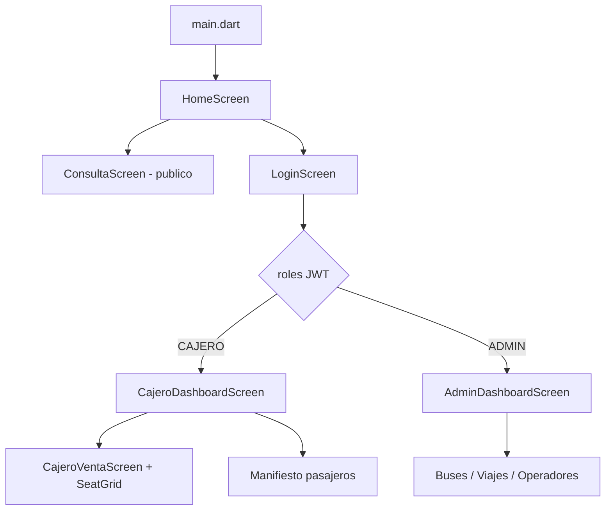

# Guía Flutter — Lo más importante (proyecto Transporte Bluefields)

Guía de aprendizaje basada en la app móvil real de este repositorio (`mobile/`). No es un curso genérico: cada concepto está ligado a código que ya funciona.

---

## 1. Qué es Flutter (en una frase)

Flutter es un **framework de Google** para crear apps con **un solo código** en Dart, que compila a Android, iOS, Web y escritorio. La UI se construye con **widgets** (componentes) anidados como árbol.

En este proyecto la app consume la **misma API REST + Keycloak** que React, pero con interfaz nativa Material Design.

---

## 2. Estructura de `mobile/lib/`

```
lib/
├── main.dart                 # Punto de entrada, rutas, Provider global
├── config/                   # URLs API, Keycloak, multi-plataforma
├── models/                   # Clases de datos (Viaje, Usuario, etc.)
├── services/                 # HTTP: login, API REST
├── providers/                # Estado global (sesión, token, roles)
├── screens/                  # Pantallas completas (Home, Login, Cajero…)
├── widgets/                  # Piezas reutilizables (mapa asientos, tarjetas)
├── theme/                    # Colores y ThemeData
└── utils/                    # JWT, formato de fechas/moneda
```

**Regla práctica:** pantalla = `screens/`, pieza reutilizable = `widgets/`, llamada HTTP = `services/`.

---

## 3. Los 8 conceptos que debes dominar

### 3.1 Widgets: todo es un widget

En Flutter **no hay HTML ni XML de layouts**. Todo es código Dart.

| Tipo | Cuándo usarlo | Ejemplo en el proyecto |
|------|---------------|------------------------|
| `StatelessWidget` | UI que no cambia sola | `HomeScreen`, `SeatLegend` |
| `StatefulWidget` | UI con formularios, listas, loading | `LoginScreen`, `ConsultaScreen` |

```dart
// Stateless: solo recibe datos y pinta
class HomeScreen extends StatelessWidget {
  @override
  Widget build(BuildContext context) {
    return Scaffold(body: ListView(...));
  }
}

// Stateful: tiene estado interno (_loading, _error, controllers)
class LoginScreen extends StatefulWidget { ... }
class _LoginScreenState extends State<LoginScreen> {
  bool _loading = false;
  // setState(() => _loading = true)  →  repinta la pantalla
}
```

**Aprende:** `build()` devuelve el árbol de widgets. `setState()` avisa a Flutter que algo cambió y hay que redibujar.

---

### 3.2 MaterialApp, rutas y navegación

`main.dart` configura la app y las rutas con nombre:

```dart
MaterialApp(
  theme: AppTheme.light,
  initialRoute: '/',
  routes: {
    '/': (_) => const HomeScreen(),
    '/cajero': (_) => const CajeroDashboardScreen(),
    '/admin': (_) => const AdminDashboardScreen(),
  },
)
```

**Dos formas de navegar** (ambas usadas en el proyecto):

```dart
// Ruta con nombre (después del login)
Navigator.pushNamed(context, '/cajero');

// Pantalla nueva en el stack (consulta pública)
Navigator.push(
  context,
  MaterialPageRoute(builder: (_) => const ConsultaScreen()),
);
```

**Aprende:** `Navigator` es la pila de pantallas. `push` entra, `pop` sale, `pushNamedAndRemoveUntil` limpia el historial (útil tras login).

---

### 3.3 Estado global con Provider

Sin Provider, pasar el token JWT a cada pantalla sería un caos. Usamos **Provider** para la sesión:

```dart
// main.dart — envuelve toda la app
ChangeNotifierProvider(
  create: (_) => AuthProvider()..init(),
  child: MaterialApp(...),
)

// Cualquier pantalla — lee o escucha cambios
final auth = context.watch<AuthProvider>();  // repinta si cambia
final auth = context.read<AuthProvider>();   // solo llama métodos (login)
```

`AuthProvider` guarda: `token`, `roles`, `perfil`, `isAuthenticated`. Cuando cambian, llama `notifyListeners()` y los widgets que hacen `watch` se actualizan.

**Aprende:** Provider = patrón **Observable** simple. Equivalente conceptual a Context/Redux en React, pero más ligero.

---

### 3.4 Async/await y ciclo de vida

Mucho en Flutter es **asíncrono** (red, disco, login):

```dart
Future<void> main() async {
  WidgetsFlutterBinding.ensureInitialized();  // obligatorio antes de plugins
  await ApiConfig.loadSaved();              // lee URL guardada
  await ApiConfig.ensureCorrectUrlForPlatform();
  runApp(const TransporteApp());
}
```

En pantallas:

```dart
Future<void> _login() async {
  setState(() => _loading = true);
  try {
    await auth.login(usuario, password);
    Navigator.pushNamed(context, '/cajero');
  } catch (e) {
    setState(() => _error = e.toString());
  } finally {
    setState(() => _loading = false);
  }
}
```

**Aprende:** siempre `setState` para loading/error; comprueba `if (!mounted) return` después de `await` si usas `context`.

---

### 3.5 HTTP + JSON + modelos

Paquete `http` — peticiones REST manuales (sin Dio):

```dart
// services/transporte_api.dart
final response = await _client.get(
  _uri('/api/publico/viajes', {'origen': origen, 'destino': destino, 'fecha': fecha}),
);
_check(response);  // lanza excepción si no es 200
final list = jsonDecode(response.body) as List;
return list.map((e) => ViajeDisponible.fromJson(e)).toList();
```

Los **modelos** convierten JSON ↔ objetos Dart:

```dart
// models/viaje.dart — patrón factory fromJson
factory ViajeDisponible.fromJson(Map<String, dynamic> json) {
  return ViajeDisponible(
    id: json['id'] as int,
    origen: json['origen'] as String,
    // ...
  );
}
```

**Aprende:** capa `Service` = HTTP; capa `Model` = forma de los datos. Igual que en Spring con DTOs.

---

### 3.6 Autenticación JWT (Keycloak)

Flujo implementado:

```
LoginScreen → AuthService.login() → POST Keycloak /token
              → guarda token en SharedPreferences
              → AuthProvider.obtenerPerfil() → GET /api/usuarios/me con Bearer
              → extrae roles del JWT → navega a /cajero o /admin
```

Login Keycloak (password grant):

```dart
// auth_service.dart
final response = await http.post(
  Uri.parse(KeycloakConfig.tokenUrl),
  body: {
    'client_id': 'transporte-api',
    'grant_type': 'password',
    'username': username,
    'password': password,
  },
);
```

Roles en el token (sin librería JWT — decodificación manual):

```dart
// utils/jwt.dart — el payload JWT es base64 JSON
final realmAccess = payload['realm_access'];
final roles = realmAccess['roles'];  // ['CAJERO', ...]
```

**Aprende:** el token viaja en header `Authorization: Bearer <token>`. Spring Boot valida el issuer; por eso importa usar `127.0.0.1` vs `localhost` de forma coherente.

---

### 3.7 Multi-plataforma: URLs distintas

| Dónde corre la app | URL del backend |
|--------------------|-----------------|
| Chrome / PC | `http://127.0.0.1:8080` |
| Emulador Android | `http://10.0.2.2:8080` |
| iPhone físico (Wi-Fi) | `http://192.168.x.x:8080` |

Centralizado en `config/api_config.dart`:

```dart
static String get keycloakRealmUrl {
  final uri = Uri.parse(baseUrl);
  return '${uri.scheme}://${uri.host}:8180/realms/transporte-bluefields';
}
```

Keycloak siempre usa **el mismo host** que la API, puerto **8180**.

**Aprende:** `dart:io` `Platform` + `kIsWeb` + `device_info_plus` detectan emulador vs teléfono físico. `shared_preferences` persiste la URL elegida.

---

### 3.8 UI compuesta: tema + widgets propios

```dart
// theme/app_theme.dart — ThemeData global (colores, botones, inputs)
ThemeData light = ThemeData(
  colorScheme: ColorScheme.fromSeed(seedColor: AppColors.primary),
  useMaterial3: true,
);

// widgets/seat_grid.dart — widget complejo reutilizable
SeatGrid(
  asientos: detalle.asientos,
  modoSeleccion: true,
  seleccionados: _seleccionados,
  onToggle: (id) => setState(() => ...),
)
```

**Aprende:** `Column`, `Row`, `ListView`, `Card`, `TextField`, `FilledButton` son widgets Material. Los combinas en widgets propios (`AppCard`, `GradientHeader`, `SeatGrid`).

---

## 4. Flujo de la app (mapa mental)



---

## 5. Paquetes que usamos (y para qué)

| Paquete | Uso en el proyecto |
|---------|-------------------|
| `flutter` (SDK) | Widgets, Material |
| `http` | REST API |
| `provider` | Estado auth global |
| `shared_preferences` | Guardar token y URL servidor |
| `intl` | Formato fechas y moneda C$ |
| `device_info_plus` | Detectar iPhone/Android físico vs emulador |

---

## 6. Cómo ejecutar y depurar

```powershell
# Emulador Android
docker compose up -d
cd backend && mvn spring-boot:run
.\scripts\flutter-android.ps1

# Chrome (web)
.\scripts\flutter-web.ps1

# Ver dispositivos
flutter devices

# Análisis estático
flutter analyze

# Tests
flutter test
```

**Depuración:** `print()` / `debugPrint()`, breakpoints en VS Code o Android Studio, F12 en Web (Network para ver JWT).

---

## 7. Qué estudiar después (orden sugerido)

1. **Dart básico** — `async/await`, `Future`, clases, `factory`, null safety (`?`, `!`)
2. **Widgets core** — [flutter.dev/docs/development/ui/widgets](https://docs.flutter.dev/development/ui/widgets)
3. **Provider** — [pub.dev/packages/provider](https://pub.dev/packages/provider)
4. **Navegación 2.0** — `go_router` (evolución de `Navigator`; no lo usamos aún)
5. **Forms y validación** — venta cajero (`cajero_venta_screen.dart`)
6. **Tests** — `widget_test.dart`, mocks de HTTP

---

## 8. Ejercicios prácticos (con este repo)

| # | Reto | Archivo de partida |
|---|------|-------------------|
| 1 | Cambiar color primario y ver efecto global | `theme/app_colors.dart` |
| 2 | Añadir campo teléfono opcional visible en comprobante | `cajero_venta_screen.dart` |
| 3 | Mostrar snackbar al guardar URL del servidor | `login_screen.dart` |
| 4 | Pull-to-refresh en lista de viajes | `consulta_screen.dart` |
| 5 | Pantalla “Acerca de” desde Home | `home_screen.dart` |

---

## 9. Comparación rápida con React (este mismo proyecto)

| Concepto | React (`frontend/`) | Flutter (`mobile/`) |
|----------|---------------------|----------------------|
| Componente | `function Component()` | `Widget build()` |
| Estado local | `useState` | `StatefulWidget` + `setState` |
| Estado global | `AuthContext` | `AuthProvider` + Provider |
| Rutas | `react-router-dom` | `MaterialApp.routes` + `Navigator` |
| HTTP | `fetch` / axios | paquete `http` |
| Estilos | CSS / MUI `sx` | `ThemeData` + propiedades en widgets |

Si ya conoces React, piensa: **Widget ≈ componente**, **Provider ≈ Context**, **setState ≈ useState**.

---

## 10. Archivos clave para leer en orden

1. `main.dart` — arranque y rutas  
2. `providers/auth_provider.dart` — sesión  
3. `services/auth_service.dart` + `transporte_api.dart` — red  
4. `screens/home_screen.dart` — navegación por rol  
5. `screens/login_screen.dart` — formulario + errores async  
6. `screens/consulta_screen.dart` — API pública + filtros  
7. `widgets/seat_grid.dart` — UI interactiva compleja  
8. `config/api_config.dart` — multi-plataforma  

---

## Referencias

- [Documentación oficial Flutter](https://docs.flutter.dev/)
- [Dart language tour](https://dart.dev/language)
- [mobile/README.md](../mobile/README.md) — ejecutar en Android, iPhone, Web
- [docs/DEMO.md](DEMO.md) — demo completa del sistema
