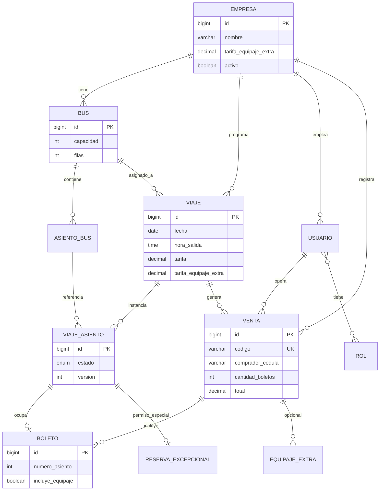

# Modelo de datos (MySQL relacional)

Base de datos: **transporte_bluefields**  
Versión: **consolidada** — ver [DISENO-BD.md](DISENO-BD.md) para decisiones de diseño.

---

## Diagrama entidad-relación



---

## Tablas

### Operación

| Tabla | Descripción |
|-------|-------------|
| `empresa` | Transportistas + tarifa default equipaje extra |
| `bus` | Unidad con `capacidad` par y `filas = capacidad/2` |
| `asiento_bus` | Layout fijo: número, fila, VENTANA/PASILLO |
| `viaje` | Salida con tarifa única y tarifa equipaje opcional |
| `viaje_asiento` | Estado del asiento en **ese** viaje + `version` |
| `venta` | Compra terminal: folio `codigo`, comprador, totales |
| `boleto` | 1 fila por asiento; `incluye_equipaje = true` |
| `equipaje_extra` | Cargo adicional en la misma venta |

### Seguridad

| Tabla | Descripción |
|-------|-------------|
| `usuario` | Local o Keycloak (`keycloak_id`) |
| `rol` | CAJERO, ADMIN_EMPRESA, ADMIN_GENERAL, RESERVA_EXCEPCIONAL |
| `usuario_rol` | N:M |
| `reserva_excepcional` | Solo permiso especial; estados de ciclo de vida |

### Vista

| Objeto | Descripción |
|--------|-------------|
| `v_cupos_viaje` | Cupos agregados por viaje para consulta pública |

---

## Layout de asientos

```
Fila 1:  [1 VENTANA] [2 PASILLO]
Fila 2:  [3 VENTANA] [4 PASILLO]
...
```

Constraints: `capacidad MOD 2 = 0`, `filas * 2 = capacidad`, UNIQUE `(bus_id, fila, posicion)`.

---

## Venta familiar (ejemplo)

```
VENTA codigo: V-1-1730000000123
├── comprador: Juan Pérez (cédula)
├── cantidad_boletos: 5
└── BOLETOS: asientos 1,2,3,4,5 (cada uno incluye_equipaje)
```

---

## Estados

**viaje_asiento:** `DISPONIBLE` | `VENDIDO` | `CANCELADO` | `RESERVADO_EXCEPCIONAL`

**viaje:** `PROGRAMADO` → `EN_CURSO` → `COMPLETADO` / `CANCELADO`

**reserva_excepcional:** `ACTIVA` → `CONVERTIDA` | `CANCELADA` | `EXPIRADA`

---

## Consultas típicas

**Consulta pública (vista):**
```sql
SELECT * FROM v_cupos_viaje
WHERE origen = 'Bluefields'
  AND destino = 'Managua'
  AND fecha = '2026-12-24'
  AND estado_viaje = 'PROGRAMADO'
ORDER BY hora_salida;
```

**Cupos disponibles:**
```sql
SELECT COUNT(*) FROM viaje_asiento
WHERE viaje_id = ? AND estado = 'DISPONIBLE';
```

---

## Archivos

- [database-schema.sql](database-schema.sql) — script completo
- [DISENO-BD.md](DISENO-BD.md) — decisiones y mejoras
- [VALIDACIONES.md](VALIDACIONES.md) — reglas por módulo
