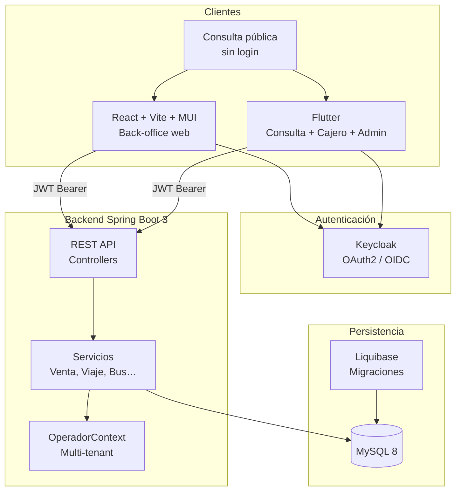
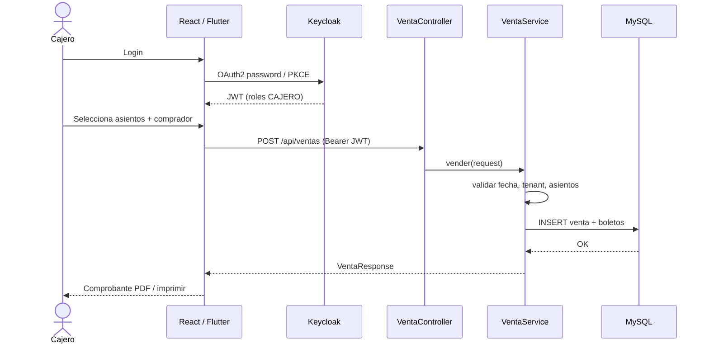
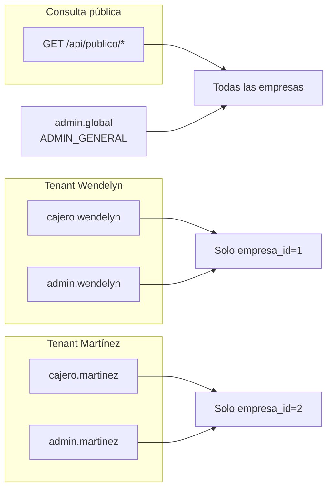
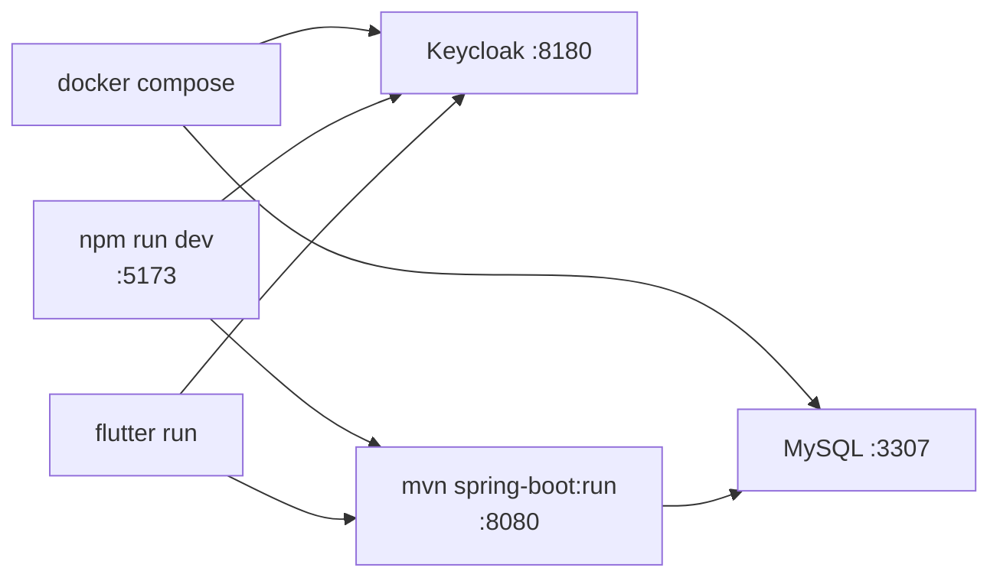

# Diagrama de arquitectura

Vista de capas del **Sistema de Gestión de Transporte Interurbano Bluefields – Managua**.

## Arquitectura general

## Flujo de venta (cajero)

## Multi-tenant

## Despliegue demo (local)

## Relación con JDL

El dominio está documentado en [`transporte.jdl`](../transporte.jdl). El proyecto **no** usa un monolito JHipster generado; el JDL sirve como contrato de diseño comparado con Liquibase.

Ver también: [MODELO-JDL.md](./MODELO-JDL.md)
