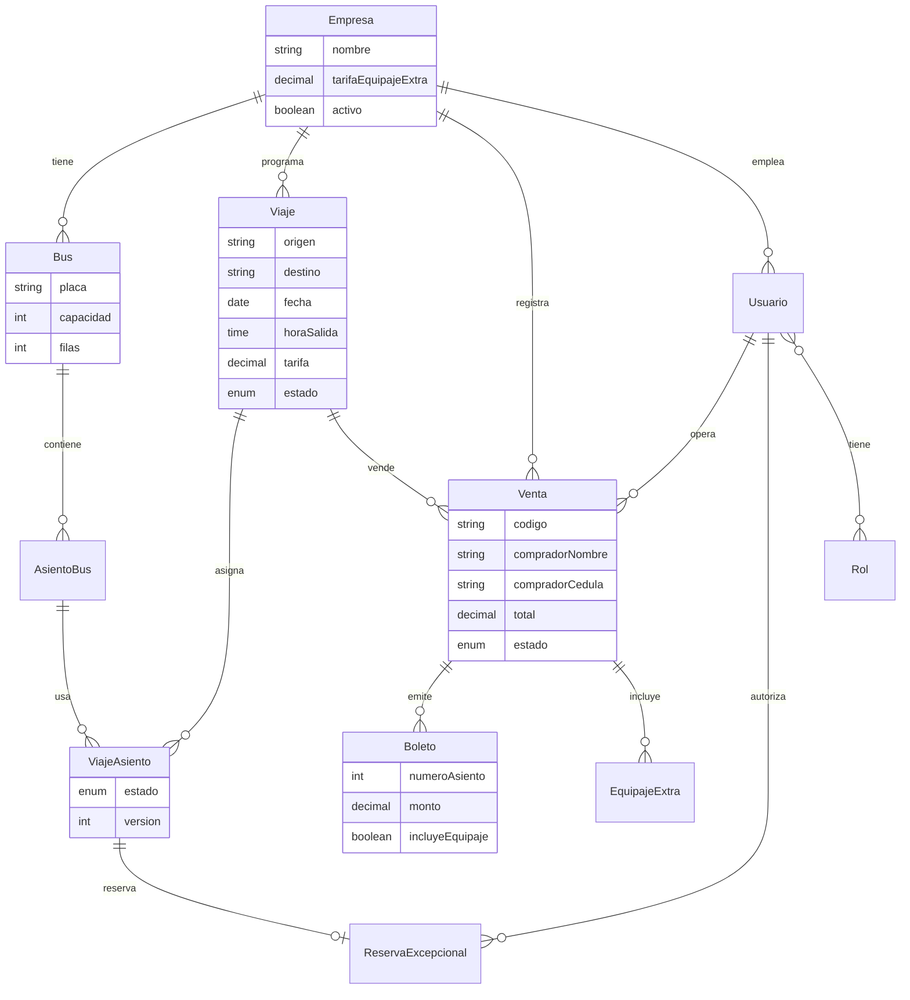

# Modelo de dominio (JDL)

Diagrama entidad-relación derivado de [`docs/transporte.jdl`](../transporte.jdl).

> Importar el JDL en [JHipster JDL Studio](https://start.jhipster.io/jdl-studio/) para exportar PNG adicional si el docente lo solicita.

## Diagrama ER

## Enums principales

| Enum | Valores |
|------|---------|
| `EstadoViaje` | PROGRAMADO, EN_CURSO, COMPLETADO, CANCELADO |
| `EstadoAsientoViaje` | DISPONIBLE, VENDIDO, CANCELADO, RESERVADO_EXCEPCIONAL |
| `EstadoVenta` | COMPLETADA, CANCELADA, PARCIALMENTE_CANCELADA |
| `PosicionAsiento` | VENTANA, PASILLO, TRASERA_1…5 |

## JDL vs implementación

| Aspecto | JDL / JHipster | Proyecto actual |
|---------|----------------|-----------------|
| Backend | Generado por JHipster | Spring Boot manual en `backend/` |
| BD | JPA auto / Liquibase JHipster | Liquibase en `db/changelog/` |
| Frontend web | React generado | React + Vite custom en `frontend/` |
| App móvil | No definida | Flutter completo en `mobile/` |
| Auth | OAuth2 | Keycloak + JWT resource server |

Documento detallado: [JDL-vs-LIQUIBASE.md](../JDL-vs-LIQUIBASE.md)
